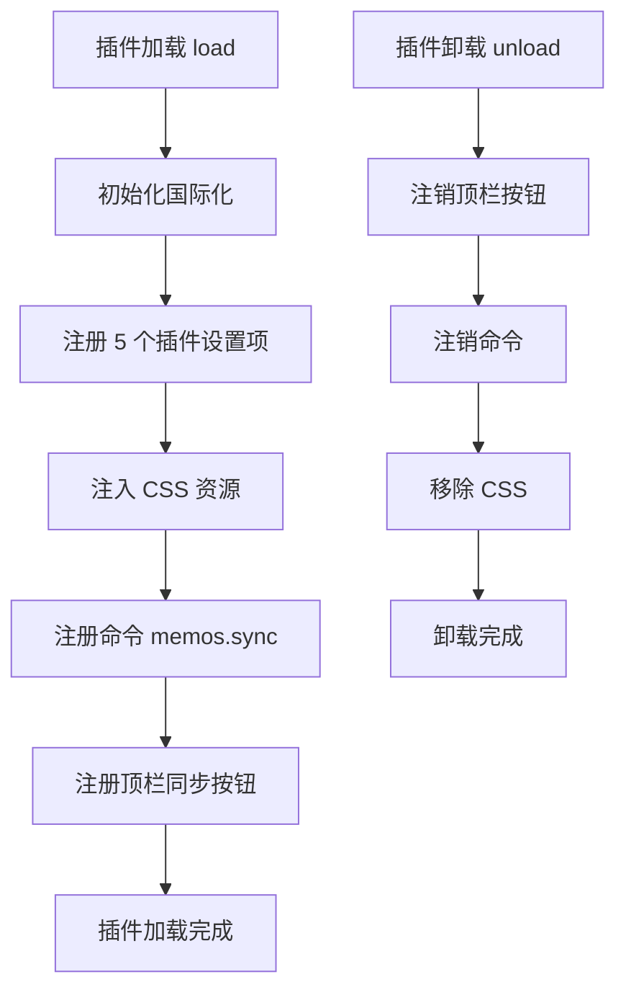
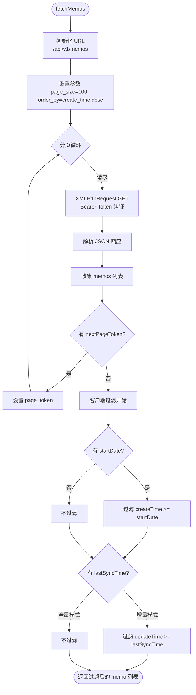
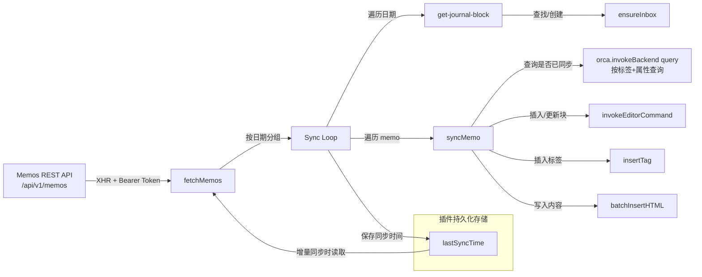

# Orca Memos Sync 插件流程图

> 使用 Mermaid 格式绘制，可在支持 Mermaid 的 Markdown 查看器中直接渲染。

---

## 1. 插件生命周期



---

## 2. 同步主流程 — `syncMemos(fullSync)`

```mermaid
flowchart TD
    Start([用户触发同步]) --> GetSettings[读取插件设置]
    GetSettings --> CheckConfig{已配置 API URL\n和 Token?}

    CheckConfig -->|否| WarnConfig[弹出警告提示\n"请先配置 API 地址和 Token"]
    WarnConfig --> End([结束])

    CheckConfig -->|是| NotifyStart[通知"开始同步..."]
    NotifyStart --> DecideMode{同步模式?}

    DecideMode -->|增量同步| ReadTime[从插件存储读取\nlastSyncTime]
    DecideMode -->|全量同步| NoTime[lastSyncTime = null]

    ReadTime --> Fetch
    NoTime --> Fetch

    Fetch[调用 fetchMemos\n从 Memos API 获取笔记] --> Filter[客户端过滤]
    Filter --> CheckEmpty{是否有笔记\n需要同步?}

    CheckEmpty -->|无| NotifyEmpty[提示"Nothing to sync"]
    NotifyEmpty --> End

    CheckEmpty -->|有| Group[按 createTime 日期分组\nstartOfDay → Map<date, memos[]>]

    Group --> InvokeGroup[组合为一次撤销操作\norca.commands.invokeGroup]

    InvokeGroup --> LoopDates{遍历每一天}

    LoopDates -->|下一日| GetJournal[获取该日期的\njournal 块]
    GetJournal --> JournalExists{journal 存在?}

    JournalExists -->|不存在| SkipDate[跳过该日]
    SkipDate --> LoopDates

    JournalExists -->|存在| EnsureInbox[确保 inbox 子块存在\nensureInbox]

    EnsureInbox --> LoopMemos{遍历该日每条 memo}

    LoopMemos -->|下一条| SyncOne[syncMemo\n同步单条笔记]
    SyncOne --> LoopMemos

    LoopMemos -->|全部完成| LoopDates

    LoopDates -->|所有日期完成| SaveTime[保存 lastSyncTime = Date.now]
    SaveTime --> NotifySuccess[通知"Memos 同步成功"]
    NotifySuccess --> End
```

---

## 3. 获取 Memos 数据 — `fetchMemos(apiUrl, token, lastSyncTime, startDate)`



---

## 4. 单条笔记同步 — `syncMemo(memo, inbox, noteTag)`

```mermaid
flowchart TD
    Start([syncMemo]) --> ExtractId[提取 memoId\n去掉 "memos/" 前缀]

    ExtractId --> Query[查询 Orca 中\n是否已存在此 memo]
    Query --> Desc[查询条件:\n标签名=noteTag\n属性 ID=memoId]

    Desc --> CheckExists{已存在?}

    CheckExists -->|是 - 覆盖更新| GetBlock[获取已有 block]
    GetBlock --> ClearTags[清空 tags 属性\n→ setProperties _tags=[]]
    ClearTags --> ClearChildren[删除所有子块\n→ deleteBlocks]

    CheckExists -->|否 - 新建| InsertBlock[在 inbox 下插入新块\n→ insertBlock]
    InsertBlock --> SetTime[设置 createTime=%createTime\nupdateTime=%updateTime]
    SetTime --> GetNewBlock[获取新 block 引用]

    ClearChildren --> InsertNoteTag
    GetNewBlock --> InsertNoteTag

    InsertNoteTag[插入 noteTag 标签\n→ insertTag(noteTag)] --> SetTagID[设置标签属性\nname=ID, value=memoId]

    SetTagID --> InsertMemosTags{memo 自带 tags?}

    InsertMemosTags -->|有| InsertTags[逐条插入标签\n→ insertTag(tag)]
    InsertTags --> StripTags

    InsertMemosTags -->|无| StripTags

    StripTags[从 content 中剥离\n重复的 #tag 文本] --> InsertContent[插入正文内容\n→ batchInsertHTML]

    InsertContent --> End([完成])
```

---

## 5. 确保收件箱 — `ensureInbox(container, inboxName)`

```mermaid
flowchart TD
    Start([ensureInbox]) --> CheckMemory{在 container.children 中\n能找到?}

    CheckMemory -->|在内存中找到| ReturnFound([返回该 inbox block])

    CheckMemory -->|未命中| QueryBackend[调用后端\nget-block 逐个查询]
    QueryBackend --> CheckBackend{后端找到?}

    CheckBackend -->|找到| CacheIt[加入 orca.state.blocks 缓存]
    CacheIt --> ReturnFound

    CheckBackend -->|不存在| CreateNew[在 container 下\n插入新块\n→ insertBlock(标题=inboxName)]
    CreateNew --> ReturnCreated([返回新 block])
```

---

## 6. 工具栏按钮 UI

```mermaid
flowchart LR
    Button[顶栏按钮] --> Hover[HoverContextMenu]
    Hover -->|左键点击| Incremental[执行增量同步\nmemos.sync(false)]
    Hover -->|悬停弹出| Menu[菜单]
    Menu --> Option1[增量同步\ninvokeCommand(false)]
    Menu --> Option2[全量同步\ninvokeCommand(true)]
```

---

## 7. 插件设置项

| 设置键 | 类型 | 默认值 | 用途 |
|--------|------|--------|------|
| `memosApiUrl` | string | `""` | Memos 实例 API 基础地址 |
| `memosApiToken` | string | `""` | 认证 Token（Bearer） |
| `inboxName` | string | `"Memos Inbox"` | 收件箱块名称 |
| `noteTag` | string | `"Memos Note"` | 同步笔记标签名 |
| `startDate` | date | `null` | 起始日期（之前的不同步） |

---

## 8. 数据流总览


